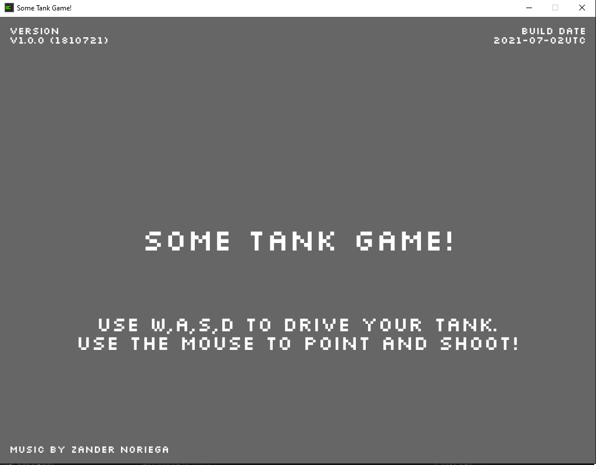
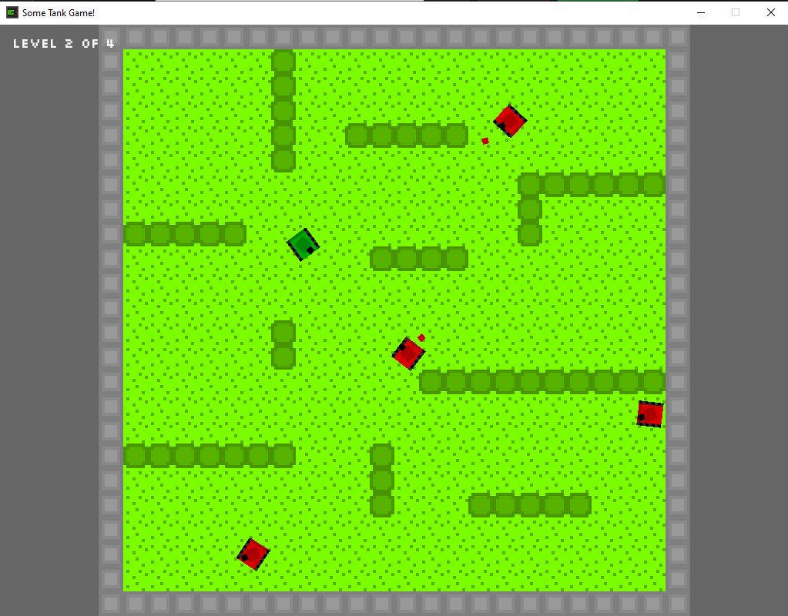

# Some Tank Game

## What?
An action game written in [Rust](https://www.rust-lang.org/) using the [Bevy](https://github.com/bevyengine/bevy) engine. 

Also runs in the [Browser](https://horup.github.io/some-tank-game-rs/)!

## Why?
I wanted to build a complete game using Rust targeting both Native and Web to evaluate if Rust is as awesome as I believe the language and eco-system to be. Current verdict is yes! Rust is awesome! 

## Credits
The Music Track used was made by Zander Noriega. 
Link: https://opengameart.org/content/fight-them-until-we-cant

